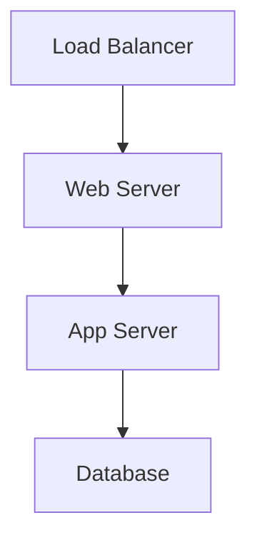

# THIS DOCKER FILE NEEDS TO BE PROPERLY UPDATED. QUICKLY GENERATED WITH AI FOR TEMPORARY PURPOSES.

# 🐳 Custom Docker Image Factory

This repository contains production-grade Dockerfiles for building optimized container images. Each image is carefully crafted for specific use cases with security, performance, and maintainability in mind.

## 🏗️ Repository Architecture

    dockerfiles/
    ├── 📁 N8N/ # Custom N8N Images
    ├── 📁 TBD/ # JDK, Python, Node, Go, etc.
    ├── 📁 TBD/ # SQL/NoSQL with optimized configs
    ├── 📁 TBD/ # Nginx, Apache, Caddy with TLS setups
    ├── 📁 TBD/ # Jenkins, GitLab Runner, ArgoCD
    ├── 📁 TBD/ # Prometheus, Grafana, ELK stacks
    └── 📁 TBD/ # CLI tools, backup utilities, etc.

## 🚦 Quick Start Guide

<details>
<summary><strong>✅ Pre-flight Checklist</strong></summary>

| Completed | Task |
|------|------|
| ✅ | Docker Engine 20.10+ installed |
| ✅ | Minimum 2 CPU cores allocated |
| ✅ | 4GB+ RAM available |
| ✅ | `docker-compose` installed (for multi-container setups) |
| ✅ | Proper disk permissions set |


</details>

## 🔥 Building Images

<details>
<summary><strong>🛠️ Comprehensive Build Process</strong></summary>

### 1. Select Your Image

# List available images
find . -name Dockerfile | sed 's/\/Dockerfile//g'

### 2. Build with Security Flags

```bash
cd path/to/image-directory

docker build \
  --no-cache \
  --pull \
  --build-arg BUILD_DATE=$(date -u +'%Y-%m-%dT%H:%M:%SZ') \
  -t myorg/image-name:$(git rev-parse --short HEAD) .
```

### 3. Verify Image

```bash
docker scan myorg/image-name  # Security scan
docker history myorg/image-name  # Layer inspection
```

</details>

# � Advanced Usage
<details> <summary><strong>🚀 Multi-Architecture Builds (ARM/x86)</strong></summary>

```bash
docker buildx create --use
docker buildx build \
  --platform linux/amd64,linux/arm64 \
  -t myorg/multiarch-image:latest \
  --push .
```

</details><details> <summary><strong>🔒 Production Deployment Checklist</strong></summary>

- Image scanned for vulnerabilities (Trivy/Grype)
- Resource limits configured
- Read-only root filesystem enabled
- Non-root user configured
- Health checks implemented
- Proper logging configured
- Secrets management in place

</details>

📦 Featured Images
<details> <summary><strong>🏆 Curated Image Catalog</strong></summary>

### 🐳 Base Images

Image	Features	Size
alpine-plus	Alpine + core utilities	15MB
distroless-plus	Google Distroless + shell	25MB

### 🛢️ Database Images

Image	Optimization	Default Config
postgres-optimized	Connection pooling	100 max_connections
redis-secure	ACL enabled	Protected mode on

### 🌐 Web Stack



</details>

# 🧪 Testing Framework
<details> <summary><strong>🧪 Image Validation Pipeline</strong></summary>

  ### 1.  Unit Tests

```bash
  container-structure-test test \
  --image my-image \
  --config tests/config.yaml
```

  ### 2. Runtime Tests

```bash
  bats tests/runtime_checks.bats
```

  ### 3. Compliance Checks

```bash
  docker run --rm -v /var/run/docker.sock:/var/run/docker.sock \
  aquasec/kube-bench:latest
```

  </details>

  # 🛡️ Security Protocols

<details> <summary><strong>🔐 Hardening Measures</strong></summary>

  - All images use COPY --chown for proper permissions
  - No secrets in build context
  - Multi-stage builds to reduce attack surface
  - DOCKER_CONTENT_TRUST=1 enforced
  - Regular base image updates

</details>

# 🤝 Contribution Matrix

| Area          | Owner       | Reviewers     |
|---------------|-------------|---------------|
| N8N   | @core-team  | @security     |
| DB Images     | @db-team    | @performance  |
| Web Servers   | @web-team   | @infra        |

# 📜 License Compliance

All images include:

    SBOM generation

    License scanning

    Attribution files

<p align="center"> ⚡ Powered by Docker | 🛡️ Security First | 🌍 Multi-Cloud Ready </p> 

## 💖 Support My Work

Enjoying this project? Help me keep it alive and evolving:

### 🌟 One-Time Donations
[](https://paypal.me/lazymediawa)

### 🔄 Recurring Support
[](https://github.com/sponsors/lazy-media)
[](https://link.lazymedia.media/patreon)

### ₿ Crypto Donations
**Bitcoin:**  
`13GdxyJ85Y78oq97Ktnr6fqdCUsa4vcMgp`

---

## 🌐 Follow Me

Stay updated with my latest projects and tutorials:

### 📱 Social Media

[](https://link.lazymedia.media/mastodon)
[](https://link.lazymedia.media/lazymedia-discord-promo-page)
[](https://link.lazymedia.media/lazymedia-gaming-discord-promo-page)

### 💻 Dev Platforms
[](https://github.com/lazy-media)
[](https://gitlab.lazymedia.media/root)

### 🎥 Video & Live Coding
[](https://youtube.com/@LazyMediaWA)
[](https://twitch.tv/LazyMediaWA)
[](https://kick.com/LazyMedia)